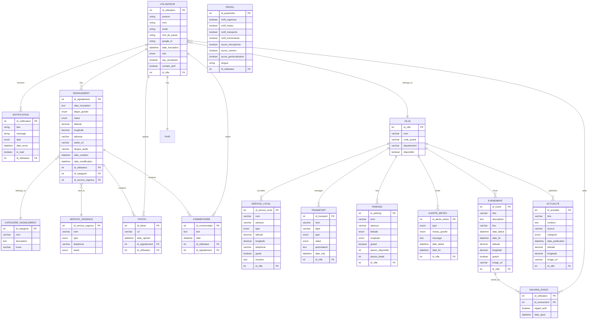

# SafeCity

Sommaire :

- Présentation du projet
- Fonctionnalités
- Epics & User stories
- Wireframes
- Maquette fonctionnelle
- MCD, MLD, MPD
- Diagramme Use case
- Rôle des acteurs
- Stack utilisée
- Installation

# Présentation du projet

SafeCity est une application mobile citoyenne pour la région toulousaine. Elle permet de signaler des incidents (accidents, incivilités, incendies, urgences médicales…), de consulter une carte interactive en temps réel, et d'accéder aux informations pratiques de la ville : transports, parkings, météo, services locaux et événements.

# Fonctionnalités :

- Signalement d'incidents — catégorie, degré de gravité, photo (3 max), géolocalisation automatique
- Description vocale multilangue — enregistrement audio + traduction automatique en français
- Carte interactive communautaire — incidents filtrés par type, statuts colorés en temps réel
- Suivi de signalement — Chronologie : Signalé --> Pris en compte --> Résolu
- Transports & Mobilité — état du réseau Tisséo (bus, métro, tram), parkings avec places disponibles & restantes ainsi que prix du parking à l'heure.
- Services locaux — médecins et pharmacies de garde, mairie, bibliothèques, contacts utiles
- Alertes météo géolocalisées — notifications push prioritaires en cas de vigilance rouge
- Actualités & Événements — agenda local avec système de favoris et rappel automatique
- Espace Administrateur — modération, changement de statuts, routage vers les services d'urgences
- Paramètres utilisateur — langue, notifications, permissions microphone/caméra/localisation

# Epics & User stories :

## Epic 1 : Authentifications et Espaces membres

### User Story

1. En tant que nouvel utilisateur, je veux pouvoir me créer un compte afin d’accéder au fonctionnalité de l’application.
2. En tant qu’utilisateur inscrit, je veux pouvoir accéder à mon compte, afin de retrouver mon profil, ma ville de préférence et mes évènement enregister.
3. En tant qu’utilisateur connecté, je veux pouvoir me déconnecter de l’application, afin de sécuriser mon compte si je n’ai plus accès à mon téléphone.
4. En tant qu’utilisateur ayant oublié mon mot de passe, je veux être en mesure de faire une demande de réinitialisation via un lien, afin de récupérer mon compte.
5. En tant qu’utilisateur soucieux de mes données, je veux pouvoir supprimer mon compte et mes données personnelles, afin de protéger ma vie privée.
6. En tant qu’utilisateur, je veux devoir accepter les Conditions Générales d’Utilisation (CGU) et la politique de confidentialité lors de mon inscription, afin de consentir à l’utilisation de ma géolocalisation.

#### Critères d’acceptation :

**Scénario : Mot de passe oublié**

- Étant donné que je suis sur la page de connexion et que je clique sur “Mot de passe oublié”,
- Lorsque je saisis une adresse mail valide et enregistré dans le système et que je valide,
- Alors le système m’envoie un mail contenant un lien sécurisé et à durée limité pour réinitialiser mon mot de passe.

## Critères d’acceptation :

**Scénario : Déconnexion de l’application**

- Étant donné que je suis connecté à mon comte et sur l’écran de mon profil,
- Lorsque je clique sur le bouton “Se déconnecté”,
- Alors le système détruit ma session et me redirige vers l’écran de connexion initial.

#### Critères d’acceptation :

**Scénario : Demande de suppression de compte (RGPD)**

- Si l’utilisateur clique sur “ Supprimer mon compte” et confirme son choix dans la fenêtre de sécurité,
- Alors le système supprime définitivement ses données personnelles de la base de données sous un délais de 30 jours et désactive immédiatement ses accès.

## Epic 2 : Gestions des signalements

1. En tant qu’utilisateur, je veux être en mesure de signaler un incident, afin que les services adéquat soient contactés.
2. En tant qu’utilisateur, je veux pouvoir être géolocaliser, afin que les secours voit exactement où je suis situé.
3. En tant qu’utilisateur, je veux pouvoir évaluer le degré de gravité de mon signalement, afin d’aider au triage et d’éviter d’engorger les services d’urgences.
4. En tant qu’utilisateur, je veux pouvoir ajouter des photos à mon signalement, afin d’être plus précis sur l’incident.
5. En tant qu’utilisateur, je veux être en mesure d’enregistré mon signalement audio dans ma langue, afin qu’il soit traduit en français.
6. En tant qu’utilisateur, je veux pouvoir suivre l’avancé de mon signalement, afin de voir si il a été réglé.

#### Critères d’acceptation :

**Scénario : Ajouter une photo à un signalement**

- Étant donné que je suis sur l’écran de création de signalement,
- Lorsque je clique sur “Ajouter une photo” et que je sélectionne un fichier image valide depuis ma galerie ou mon appareil photo,
- Alors le système affiche la miniature de la photo jointe et me permet d’ajouter jusqu’à 3 photos maximum.

**Scénario : Géolocalisation de l’incident automatique**

- Étant donné que j’ouvre l’interface de signalement et que le GPS de mon téléphone est activé,
- Lorsque l’écran se charge,
- Alors le système récupère automatiquement mes coordonnées GPS exactes et affiche l’adresse correspondante dans le champ du lieu.

## Epic 3 : Informations et servies locaux

1. En tant qu’utilisateur, je veux pouvoir m’informer sur les médecins et pharmacie de garde autour de mon secteur, afin d’accéder à des soins en dehors des heures d’ouvertures classiques.
2. En tant qu’utilisateur, je veux recevoir des alertes météo géolocalisé (canicule,gel,pluie), afin d’adapter mon comportement et/ou mes déplacements face aux intempéries
3. En tant qu’utilisateur, je veux avoir accès au informations pratique de ma ville(Mairie, Bibliothèque etc), afin de faciliter mes démarches administratives et culturelle.

#### Critères d’acceptation :

**Scénario : Recherche professionnel de garde “Autour de moi”**

- Étant donné que je suis sur l’onglet “Service de santé” et que j’autorise la géolocalisation,
- Lorsque je filtre par “Pharmacie de garde” ou “Médecin de garde”,
- Alors le système affiche la liste et la carte des professionnels de garde actifs classées du plus proche au plus lointain.

**Scénario : Réception d’une alerte météo critique**

- Si la météo de Toulouse émet un bulletin de vigilance rouge (Vague de chaleur, gel, neige),
- Alors le système envoie une notification push prioritaire à tous les utilisateurs ayant choisi Toulouse ou le département comme secteur de préférence.

## Epic 4 : Transports et mobilité

1. En tant qu’utilisateur, je veux être capable de consulter l’état du réseau de transport en commun(Bus,Métro,Tram, pannes et horaires), afin de planifier mon trajet sereinement
2. En tant qu’utilisateur, je veux pouvoir localiser les parkings à proximité en voyant si ils sont gratuits ou payants, afin de facilité mon stationnement.
3. En tant qu’utilisateur, je veux signaler un incident routier (accident, travaux, danger), afin d’avertir la communauté et les autorités compétentes des perturbations.

**Scénario :Recherche de parking à proximité**

- Étant donné que je suis sur l’écran “Mobilité-Parkings”,
- Lorsque je saisis une adresse ou que je me géolocalise,
- Alors le système m’affiche les parkings disponible autour en spécifiant clairement par un indicateur visuel s’ils sont “Gratuits” ou “Payants”.

**Scénario : Signalement d’un incident routier**

- Étant donné que je suis témoin d’un comportement dangereux ou d’un accident sur la route,
- Lorsque je crée un post dans la catégorie “Incident Routier” avec une description,
- Alors le système publie l’alerte instantanément sur le fil routier et met à jour la carte pour les conducteurs à proximité.

## Epic 5 : Actualités et évènements

1. En tant qu’utilisateur, je veux suivre l’actualité du secteur Toulousain, afin de rester informé de la vie de mon agglomération.
2. En tant qu’utilisateur, je veux parcourir les évènements de ma ville, afin de prévoir des sorties potentielles.
3. En tant qu’utilisateur, je veux pouvoir enregistrer ou mettre en favoris les évènements qui m’intéressent, afin de les retrouver facilement plus tard et m’organiser.

**Scénario : Mise en favoris d’un évènement local**

- Étant donné que je consulte la liste des évènements à venir sur Toulouse,
- Lorsque je clique sur l’icône “Favoris” d’un évènement (exemple: festival),
- Alors le système ajoute cet évènement à mon calendrier personnel dans l’application et m’enverra un rappel 24 heures avant le début.

## Epic 6 : Cartographie et communauté

1. En tant qu’utilisateur, je veux consulter une carte interactive des signalements, afin de voir les incidents signalés sur mon chemin en temps réel.
2. En tant qu’utilisateur, je veux voir le statut du signalement (réglé, en cours), afin d’être rassuré de l’efficacité de l’application et l’intervention des services.
3. En tant qu’utilisateur, je veux pouvoir ajouter des commentaires ainsi que des photos sur les posts d’incidents des autres utilisateurs, afin d’apporter des précisions supplémentaires (évolution d’un accident, travaux…).

**Scénario :Suivi de l’état d’un signalement**

- Étant donné que je consulte la carte interactive des incidents de mon secteur,
- Lorsque je clique sur l’icône d’un incident que j’ai signalé ou croisé,
- Alors le système m’affiche une fiche détaillé indiquant le statut mis à jour en temps réel: “Signalé”, “Pris en compte” ou “Résolu”.

**Scénario : Commenter ou précisions d’un incident existant**

- Étant donné que je sélectionne un incident déjà affiché sur la carte par un autre utilisateur,
- Lorsque je rédige un commentaire ou que j’ajoute une nouvelle photo pour montrer l’évolution de la situation,
- Alors le système valide mon commentaire et le rend visible pour tous les autres utilisateurs qui consulteront ce même incident.

## Epic 7 : Espace Administrateur

1. En tant qu’administrateur, je veux paramétrer les règles automatique selon le degré d’urgence, afin que les signalements partent instantanément au bon service (Police, Gendarmerie, Samu, Pompiers…).
2. En tant qu’administrateur, je veux pouvoir changer le statut d’un signalement (en attente, en cours, résolu), afin de tenir informée la communauté de la résolution du problème.
3. En tant qu’administrateur, je veux pouvoir modérer les posts, les photos et les commentaires des utilisateurs, afin de garantir la fiabilité des informations et éviter les abus.

**Scénario : Modification manuelle du statut par un administrateur**

- Étant donné que je suis connecté en tant qu’administrateur sur le tableau de bord,
- Lorsque je reçois la confirmation qu’une équipe municipale a nettoyé une dégradation ou qu’une obstacle routier a été dégagé et que je change le statut sur “Résolu”,
- Alors le système met à jour instantanément la carte publique et retire l’icône d’alerte pour les utilisateurs.

**Scénario : Modération de contenu inapproprié**

- Si un utilisateur poste une photo ou un commentaire jugé inapproprié ou hors-sujet, et qu’un administrateur clique sur “Masquer le contenu”,
- Alors le contenu disparaît immédiatement de l’application publique et l’utilisateur reçoit un avertissement automatique par email.

## Epic 8 : Paramètre et notification

1. En tant qu’utilisateur, je veux pouvoir gérer l’activation ou la désactivation des notifications, afin d’être alerté si une urgence se trouve à proximité sans être spammé.
2. En tant qu’utilisateur, je veux être en mesure de définir la langue par défaut dans mes paramètres, afin que le traducteur vocale et l’interface soit adapté automatiquement à ma langue.
3. En tant qu’utilisateur, je veux pouvoir gérer autoriser ou refuser l’accès au microphone et caméra de mon téléphone, afin de pouvoir utiliser les fonctions de signalement photo et audio.

# Wireframes :

Le wireframe à été réalisé sur Figma.
Lien du Figma :

# Maquette fonctionnelle :

La maquette fonctionnelle à été réalisé sur Figma:
Lien du Figma :

# MLD :

# Diagramme Use Case :

-----------------------------------------------------------------------------------------------------------------------------------------

| Technique | Technologie |
| --- | --- |
| Frontend | Symfony (Twig) |
| Backend | Symfony (PHP) |
| Base de données | MongoDB /Postgrey |
| Authentification | Session + Google OAuth2 |
| Cartographie | *(à définir)* |
| Traduction vocale | *(à définir)* |
| Notifications push | *(à définir)* |
| Conteneurisation | Docker |
