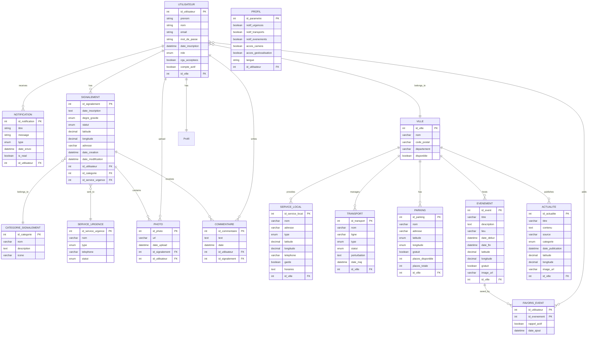

# SafeCity

Sommaire :

- Présentation du projet
- Fonctionnalités
- Epics & User stories
- Wireframes
- Maquette fonctionnelle
- MCD, MLD, MPD
- Diagramme Use case
- Rôle des acteurs
- Stack utilisée
- Installation

# Présentation du projet

SafeCity est une application mobile citoyenne pour la région toulousaine. Elle permet de signaler des incidents (accidents, incivilités, incendies, urgences médicales…), de consulter une carte interactive en temps réel, et d'accéder aux informations pratiques de la ville : transports, parkings, services locaux et événements.

# Fonctionnalités

- Comptes locaux sécurisés — inscription avec consentement obligatoire, vérification de l’adresse e-mail, connexion, déconnexion et réinitialisation du mot de passe.
- Profil utilisateur — ville, langue, préférences de notification, permissions caméra et géolocalisation, désactivation immédiate et suppression différée du compte.
- Signalements textuels — catégorie, degré de gravité, adresse, géolocalisation et trois photos facultatives au maximum.
- Carte communautaire — signalements de la ville, filtres, statuts et mises à jour en temps réel avec Mercure.
- Suivi des signalements — historique des statuts « Signalé », « Pris en compte » et « Résolu ».
- Communauté — commentaires, photos complémentaires et signalement des contenus inappropriés.
- Transports et mobilité — sous-ensemble local Tisséo composé des métros, tramways et de quelques lignes de bus, ainsi que des parkings géolocalisés.
- Parkings — disponibilité, gratuité, tarif horaire, classement par distance et affichage cartographique.
- Services locaux — mairie, bibliothèques, services municipaux, médecins et pharmacies de garde avec horaires et alternatives proches.
- Actualités et événements — contenus par ville, favoris et rappels automatiques avant les événements.
- Administration — suivi des signalements, historique des statuts, règles de routage et modération des commentaires et photos.
- Notifications — préférences individuelles, notifications internes, alertes navigateur avec Stimulus et diffusion locale par Mercure.
- Données locales — fixtures fictives couvrant neuf villes et rechargeables sans doublon.
- Qualité — tests fonctionnels, services, commandes, sécurité, fixtures et entités exécutés sur une base PostgreSQL de test.

# Epics & User Stories

Chaque User Story ci-dessous forme une unité autonome pouvant être copiée dans une issue. Le statut décrit l’état actuel dans la copie locale du projet.

## Epic 1 — Authentification, compte et cadre légal

### AUTH-US01 — Créer un compte local

**Statut actuel :** Implémentée.

**User Story :** En tant que nouvel utilisateur, je veux créer un compte avec mon identité, mon adresse e-mail, ma ville, ma langue et mon mot de passe afin d’accéder aux fonctionnalités de SafeCity.

**Critères d’acceptation :**

- [ ] Le formulaire est un formulaire Symfony et valide tous les champs obligatoires.
- [ ] Le mot de passe est confirmé puis haché avant son enregistrement.
- [ ] Un profil contenant la langue et les préférences par défaut est créé avec le compte.
- [ ] Une adresse e-mail déjà utilisée ne peut pas créer un second compte.

### AUTH-US02 — Accepter les CGU et la politique de confidentialité

**Statut actuel :** Implémentée pour l’utilisation locale.

**User Story :** En tant que nouvel utilisateur, je veux consulter et accepter les CGU et la politique de confidentialité afin de donner mon consentement avant la création du compte.

**Critères d’acceptation :**

- [ ] Les deux documents sont accessibles sans authentification.
- [ ] Le formulaire d’inscription contient des liens vers ces documents.
- [ ] La case de consentement est obligatoire et une inscription sans consentement est refusée.
- [ ] Le consentement est enregistré dans le compte créé.

### AUTH-US03 — Vérifier l’adresse e-mail

**Statut actuel :** Implémentée.

**User Story :** En tant que nouvel utilisateur, je veux recevoir un lien signé afin de vérifier mon adresse e-mail et d’activer l’accès à mon compte.

**Critères d’acceptation :**

- [ ] L’inscription crée un compte non vérifié et prépare un e-mail de confirmation.
- [ ] Le lien signé est accessible avant la première connexion et possède une durée de validité.
- [ ] Un lien valide marque le compte comme vérifié.
- [ ] Un compte non vérifié ne peut pas se connecter et reçoit un message explicite.

### AUTH-US04 — Se connecter et se déconnecter

**Statut actuel :** Implémentée.

**User Story :** En tant qu’utilisateur vérifié, je veux ouvrir et fermer une session Symfony afin d’utiliser mon espace personnel en sécurité.

**Critères d’acceptation :**

- [ ] Une combinaison e-mail/mot de passe valide ouvre la session.
- [ ] Un compte désactivé ou non vérifié est refusé.
- [ ] La déconnexion détruit la session authentifiée et redirige vers la connexion.

### AUTH-US05 — Réinitialiser un mot de passe oublié

**Statut actuel :** Implémentée.

**User Story :** En tant qu’utilisateur ayant oublié son mot de passe, je veux recevoir un lien temporaire afin d’en choisir un nouveau.

**Critères d’acceptation :**

- [ ] La demande ne révèle pas si l’adresse e-mail existe.
- [ ] Un compte existant reçoit un e-mail contenant un jeton temporaire.
- [ ] Le nouveau mot de passe respecte les contraintes de sécurité et est haché.
- [ ] Le jeton est supprimé après utilisation et ne peut pas être réutilisé.

### AUTH-US06 — Modifier le profil et les préférences

**Statut actuel :** Implémentée.

**User Story :** En tant qu’utilisateur connecté, je veux modifier mon identité, mon adresse e-mail, ma ville, ma langue et mes préférences afin de garder mon profil à jour.

**Critères d’acceptation :**

- [ ] Les informations du compte et les préférences sont gérées par deux formulaires Symfony distincts.
- [ ] Seules les villes disponibles peuvent être sélectionnées.
- [ ] Le changement de langue est appliqué dès la redirection suivante.

### AUTH-US07 — Désactiver puis supprimer le compte

**Statut actuel :** Implémentée.

**User Story :** En tant qu’utilisateur, je veux désactiver mon compte puis faire supprimer mes données après trente jours afin de protéger ma vie privée.

**Critères d’acceptation :**

- [ ] Une confirmation protégée par CSRF est obligatoire.
- [ ] Le compte est immédiatement désactivé et anonymisé.
- [ ] Les permissions caméra et géolocalisation sont révoquées.
- [ ] Une commande locale supprime après trente jours le compte, ses contenus, ses notifications, ses jetons et ses fichiers personnels.

## Epic 2 — Signalements et suivi des incidents

### REPORT-US01 — Créer un signalement textuel

**Statut actuel :** Implémentée.

**User Story :** En tant qu’utilisateur connecté, je veux décrire un incident par écrit afin d’informer la communauté et les services concernés.

**Critères d’acceptation :**

- [ ] Le formulaire Symfony demande une description, une catégorie et un niveau de gravité.
- [ ] Le signalement est rattaché à l’utilisateur et à sa ville.
- [ ] Un signalement vide ou invalide n’est pas enregistré.
- [ ] La saisie audio n’est pas proposée dans le périmètre actuel.

### REPORT-US02 — Géolocaliser un signalement

**Statut actuel :** Implémentée avec Stimulus et l’API de géolocalisation du navigateur.

**User Story :** En tant qu’utilisateur, je veux utiliser ma position ou saisir un lieu afin de localiser précisément l’incident.

**Critères d’acceptation :**

- [ ] La géolocalisation n’est demandée que si la préférence du profil l’autorise.
- [ ] Les coordonnées sont validées avant enregistrement.
- [ ] Une adresse peut être conservée avec les coordonnées.
- [ ] Un refus ou une indisponibilité du navigateur n’empêche pas la saisie manuelle.

### REPORT-US03 — Ajouter des photos au signalement

**Statut actuel :** Implémentée.

**User Story :** En tant qu’utilisateur, je veux joindre jusqu’à trois photos afin d’illustrer l’incident sans rendre la photo obligatoire.

**Critères d’acceptation :**

- [ ] Zéro à trois fichiers image peuvent être joints.
- [ ] Le type, la taille et le nom du fichier sont contrôlés côté Symfony.
- [ ] Les fichiers sont enregistrés localement avec un nom sûr.
- [ ] Une création interrompue nettoie les fichiers devenus inutiles.

### REPORT-US04 — Suivre l’historique des statuts

**Statut actuel :** Implémentée.

**User Story :** En tant qu’utilisateur, je veux consulter la chronologie d’un signalement afin de connaître son avancement.

**Critères d’acceptation :**

- [ ] Les étapes « Signalé », « Pris en compte » et « Résolu » sont historisées.
- [ ] Chaque changement conserve sa date et son auteur administratif lorsqu’il existe.
- [ ] La fiche du signalement affiche l’historique dans l’ordre chronologique.

### REPORT-US05 — Consulter mes signalements

**Statut actuel :** Implémentée.

**User Story :** En tant qu’utilisateur, je veux retrouver uniquement mes signalements afin de suivre mes propres demandes.

**Critères d’acceptation :**

- [ ] Une page dédiée liste les signalements créés par l’utilisateur connecté.
- [ ] Chaque élément donne accès à sa fiche et à son statut.
- [ ] Les données d’un autre compte ne sont pas présentées comme appartenant à l’utilisateur.

### REPORT-US06 — Supprimer mon signalement

**Statut actuel :** Implémentée.

**User Story :** En tant qu’auteur, je veux supprimer mon signalement afin de retirer un contenu devenu inutile ou erroné.

**Critères d’acceptation :**

- [ ] Seul l’auteur ou un administrateur autorisé peut déclencher la suppression.
- [ ] La requête est protégée par CSRF.
- [ ] Les commentaires, photos, historiques et dossiers de modération associés sont nettoyés sans fichier orphelin.

### REPORT-US07 — Router automatiquement un signalement

**Statut actuel :** Implémentée avec des règles locales.

**User Story :** En tant qu’utilisateur, je veux que mon signalement soit orienté vers le service configuré pour sa catégorie et sa gravité afin d’éviter un tri manuel systématique.

**Critères d’acceptation :**

- [ ] Le routeur recherche une règle active correspondant à la gravité et, si précisé, à la catégorie.
- [ ] La règle ayant la meilleure priorité est utilisée.
- [ ] L’absence de règle ne bloque pas la création du signalement.

## Epic 3 — Informations et services locaux

### SERVICE-US01 — Consulter les services municipaux

**Statut actuel :** Implémentée.

**User Story :** En tant qu’utilisateur, je veux consulter les services de ma ville afin de trouver une mairie, une bibliothèque, un établissement éducatif ou un service d’urbanisme.

**Critères d’acceptation :**

- [ ] Seuls les services de la ville du profil sont affichés.
- [ ] Les résultats sont regroupés par type et peuvent être recherchés par nom ou adresse.
- [ ] L’adresse, le téléphone et les horaires sont visibles lorsqu’ils sont renseignés.

### SERVICE-US02 — Rechercher un médecin ou une pharmacie de garde

**Statut actuel :** Implémentée.

**User Story :** En tant qu’utilisateur, je veux filtrer les médecins et pharmacies afin de trouver un professionnel adapté à mon besoin.

**Critères d’acceptation :**

- [ ] Les parcours médecins et pharmacies sont séparés.
- [ ] Les filtres « Tous », « De garde » et « Ouvert 24 h/24 » sont disponibles.
- [ ] Une recherche par nom ou adresse peut compléter le filtre.

### SERVICE-US03 — Localiser les services de santé

**Statut actuel :** Implémentée avec Stimulus et Leaflet.

**User Story :** En tant qu’utilisateur ayant autorisé la localisation, je veux classer les professionnels par distance et les voir sur une carte afin de choisir le plus proche.

**Critères d’acceptation :**

- [ ] Le bouton de localisation respecte la préférence enregistrée dans le profil.
- [ ] Les coordonnées invalides ou incomplètes sont ignorées sans casser la page.
- [ ] Les résultats sont triés du plus proche au plus éloigné.
- [ ] La carte et les distances sont calculées sans API cartographique payante.

### SERVICE-US04 — Afficher les horaires et les gardes

**Statut actuel :** Implémentée avec des données locales fictives.

**User Story :** En tant qu’utilisateur, je veux voir les horaires et le statut de garde afin de savoir quand contacter un établissement.

**Critères d’acceptation :**

- [ ] Les horaires sont affichés pour les services qui ne sont pas ouverts en permanence.
- [ ] Les établissements ouverts 24 h/24 sont clairement identifiés.
- [ ] Le statut de garde reste une donnée locale de démonstration et n’est pas présenté comme une donnée nationale en temps réel.

### SERVICE-US05 — Proposer des alternatives proches

**Statut actuel :** Implémentée.

**User Story :** En tant qu’utilisateur consultant un établissement indisponible, je veux voir deux alternatives de garde proches afin de trouver rapidement une autre solution.

**Critères d’acceptation :**

- [ ] Les alternatives appartiennent à la même ville et au même parcours médecin ou pharmacie.
- [ ] Deux alternatives de garde au maximum sont classées par distance depuis l’établissement initial.
- [ ] Leur adresse, leur distance, leurs horaires, leur téléphone et leur itinéraire sont accessibles.
- [ ] Le calcul est local et n’utilise aucun fournisseur facturable.

## Epic 4 — Transports, parkings et mobilité

### TRANSPORT-US01 — Consulter le réseau Tisséo retenu

**Statut actuel :** Implémentée avec une source gratuite et un jeu local de secours.

**User Story :** En tant qu’utilisateur, je veux consulter les métros, tramways et quelques lignes de bus afin de disposer d’un aperçu lisible du réseau Tisséo.

**Critères d’acceptation :**

- [ ] Les lignes de métro et de tramway prévues sont présentes.
- [ ] Le nombre de lignes de bus reste volontairement limité pour ne pas surcharger l’interface.
- [ ] Les données sont normalisées avant leur affichage dans Twig.
- [ ] Aucun service ou abonnement payant n’est nécessaire.

### TRANSPORT-US02 — Continuer à afficher les transports hors ligne

**Statut actuel :** Implémentée.

**User Story :** En tant qu’utilisateur local, je veux conserver un réseau de démonstration lorsqu’une source distante gratuite est indisponible afin que la page ne soit jamais vide.

**Critères d’acceptation :**

- [ ] Une lecture locale GTFS ou un jeu local peut alimenter le réseau.
- [ ] Une indisponibilité distante ne provoque pas d’erreur de page.
- [ ] L’interface indique quand la donnée complète n’est pas disponible.

### PARKING-US01 — Consulter les parkings de la ville

**Statut actuel :** Implémentée.

**User Story :** En tant qu’utilisateur, je veux voir les parkings de ma ville en liste et sur une carte afin de préparer mon stationnement.

**Critères d’acceptation :**

- [ ] Les parkings sont limités à la ville du profil.
- [ ] Chaque parking affiche son nom, son adresse et ses coordonnées cartographiques.
- [ ] La carte repose sur Leaflet sans intégrer de SDK Google Maps payant.

### PARKING-US02 — Classer les parkings par proximité

**Statut actuel :** Implémentée avec Stimulus.

**User Story :** En tant qu’utilisateur ayant autorisé la géolocalisation, je veux trier les parkings par distance afin de trouver le plus proche.

**Critères d’acceptation :**

- [ ] Le bouton « Me localiser » ne fonctionne que lorsque la préférence du profil l’autorise.
- [ ] Les distances sont calculées localement à partir des coordonnées valides.
- [ ] Le refus de géolocalisation conserve la liste normale des parkings.

### PARKING-US03 — Comparer disponibilité et prix

**Statut actuel :** Implémentée avec des données fictives locales.

**User Story :** En tant qu’automobiliste, je veux connaître les places disponibles, la gratuité et le tarif horaire afin de choisir un parking adapté.

**Critères d’acceptation :**

- [ ] Les places disponibles et totales sont affichées avec un état visuel cohérent.
- [ ] Un parking gratuit est distingué d’un parking payant.
- [ ] Le tarif horaire est affiché pour les parkings payants et reste absent pour les parkings gratuits.

### MOBILITY-US01 — Signaler un incident routier

**Statut actuel :** Implémentée au moyen des catégories de signalement.

**User Story :** En tant qu’utilisateur, je veux créer un signalement routier afin d’avertir la communauté d’un accident, de travaux ou d’un danger.

**Critères d’acceptation :**

- [ ] Une catégorie routière peut être choisie dans le formulaire de signalement.
- [ ] Le signalement apparaît dans la liste et la carte de la ville.
- [ ] Les changements de statut suivent le même historique que les autres incidents.

## Epic 5 — Actualités, événements et favoris

### NEWS-US01 — Consulter les actualités de ma ville

**Statut actuel :** Implémentée avec des données locales fictives.

**User Story :** En tant qu’utilisateur, je veux consulter les actualités associées à ma ville afin de rester informé de la vie locale.

**Critères d’acceptation :**

- [ ] Les actualités sont filtrées selon la ville du profil.
- [ ] Les contenus sont classés par date de publication.
- [ ] Chaque actualité affiche son titre, sa catégorie, son contenu et sa source lorsqu’ils existent.

### NEWS-US02 — Identifier les nouvelles informations

**Statut actuel :** Implémentée.

**User Story :** En tant qu’utilisateur, je veux voir un indicateur lorsqu’une actualité ou une notification récente existe afin de ne pas manquer une information locale.

**Critères d’acceptation :**

- [ ] L’indicateur dépend de données destinées à l’utilisateur connecté.
- [ ] La lecture de la page ou de la notification permet de présenter un état cohérent.
- [ ] Aucun indicateur appartenant à un autre compte n’est exposé.

### EVENT-US01 — Consulter les événements à venir

**Statut actuel :** Implémentée avec des données locales fictives.

**User Story :** En tant qu’utilisateur, je veux parcourir les événements futurs de ma ville afin de préparer des sorties.

**Critères d’acceptation :**

- [ ] Seuls les événements futurs de la ville sont proposés.
- [ ] Le titre, le lieu, les horaires, la catégorie et la gratuité sont visibles.
- [ ] Les événements passés ne sont pas présentés comme à venir.

### EVENT-US02 — Ajouter un événement aux favoris

**Statut actuel :** Implémentée.

**User Story :** En tant qu’utilisateur, je veux ajouter ou retirer un événement de mes favoris afin de le retrouver facilement.

**Critères d’acceptation :**

- [ ] L’action est protégée par CSRF et limitée aux événements de la ville de l’utilisateur.
- [ ] Un même utilisateur ne peut pas créer deux favoris pour le même événement.
- [ ] Une page personnelle liste les événements favoris.

### EVENT-US03 — Recevoir un rappel d’événement

**Statut actuel :** Implémentée avec Symfony Scheduler, Messenger et Mailer.

**User Story :** En tant qu’utilisateur ayant activé les rappels, je veux être averti environ vingt-quatre heures avant un événement favori afin de ne pas l’oublier.

**Critères d’acceptation :**

- [ ] Seuls les favoris dont le rappel est actif sont sélectionnés.
- [ ] Le rappel est créé une seule fois grâce à une date d’envoi persistée.
- [ ] La préférence globale de notification d’événements est respectée.
- [ ] L’e-mail passe par la file locale Symfony et ne dépend d’aucun fournisseur payant.

## Epic 6 — Cartographie et communauté

### COMMUNITY-US01 — Consulter la carte des signalements

**Statut actuel :** Implémentée avec Leaflet.

**User Story :** En tant qu’utilisateur, je veux voir les signalements de ma ville sur une carte afin d’identifier les incidents proches.

**Critères d’acceptation :**

- [ ] Seuls les signalements visibles de la ville de l’utilisateur sont exposés à la carte.
- [ ] Les marqueurs distinguent les catégories ou statuts nécessaires à la lecture.
- [ ] Un marqueur permet d’accéder à la fiche détaillée du signalement.

### COMMUNITY-US02 — Filtrer les incidents visibles

**Statut actuel :** Implémentée.

**User Story :** En tant qu’utilisateur, je veux filtrer la carte et les listes afin de me concentrer sur les incidents pertinents.

**Critères d’acceptation :**

- [ ] Les filtres ne révèlent aucun signalement d’une ville différente.
- [ ] Un signalement masqué par la modération reste absent des résultats communautaires.
- [ ] Une combinaison invalide de filtres ne provoque pas d’erreur serveur.

### COMMUNITY-US03 — Commenter un signalement

**Statut actuel :** Implémentée.

**User Story :** En tant qu’utilisateur de la même ville, je veux commenter un signalement afin d’ajouter une précision sur son évolution.

**Critères d’acceptation :**

- [ ] Le commentaire est lié au signalement et à son auteur.
- [ ] Un utilisateur d’une autre ville ne peut pas participer au fil.
- [ ] Le contenu est validé avant enregistrement et affiché dans l’ordre prévu.

### COMMUNITY-US04 — Ajouter une photo à un commentaire

**Statut actuel :** Implémentée.

**User Story :** En tant qu’utilisateur, je veux joindre une photo facultative à mon commentaire afin d’illustrer une évolution de l’incident.

**Critères d’acceptation :**

- [ ] La photo est facultative et passe par le même service sécurisé de téléversement.
- [ ] Elle reste associée au commentaire et au signalement pour la galerie.
- [ ] Une erreur de validation ne laisse aucun fichier local orphelin.

### COMMUNITY-US05 — Signaler un contenu inapproprié

**Statut actuel :** Implémentée.

**User Story :** En tant qu’utilisateur, je veux signaler un commentaire ou une photo afin qu’un administrateur puisse le contrôler.

**Critères d’acceptation :**

- [ ] Un motif de signalement stable est enregistré.
- [ ] Un utilisateur ne peut pas signaler son propre contenu ni un contenu d’une autre ville.
- [ ] Un même contenu ne génère pas plusieurs dossiers de modération ouverts identiques.
- [ ] Le contenu reste visible tant qu’un administrateur n’a pas choisi de le masquer.

### COMMUNITY-US06 — Recevoir les mises à jour en temps réel

**Statut actuel :** Implémentée avec Mercure.

**User Story :** En tant qu’utilisateur connecté, je veux recevoir les changements pertinents sans recharger manuellement la page afin de suivre l’activité locale.

**Critères d’acceptation :**

- [ ] Les sujets Mercure destinés à un utilisateur ne sont pas devinables à partir de son seul identifiant.
- [ ] Une indisponibilité du hub n’empêche pas la persistance de la modification métier.
- [ ] Stimulus met à jour ou signale l’information reçue sans JavaScript autonome supplémentaire.

## Epic 7 — Administration, routage et modération

### ADMIN-US01 — Accéder à un espace réservé aux administrateurs

**Statut actuel :** Implémentée.

**User Story :** En tant qu’administrateur, je veux accéder à un tableau de bord protégé afin de gérer les fonctions sensibles de SafeCity.

**Critères d’acceptation :**

- [ ] Toutes les routes `/admin` exigent le rôle administrateur.
- [ ] Un utilisateur standard reçoit un refus d’accès.
- [ ] Le tableau de bord donne accès aux signalements, utilisateurs, règles et dossiers de modération disponibles.

### ADMIN-US02 — Modifier le statut d’un signalement

**Statut actuel :** Implémentée.

**User Story :** En tant qu’administrateur, je veux passer un signalement à « Pris en compte » ou « Résolu » afin d’informer les citoyens de son avancement.

**Critères d’acceptation :**

- [ ] La modification est protégée par CSRF et refuse un statut invalide.
- [ ] Chaque transition crée une entrée dans l’historique.
- [ ] La nouvelle valeur est visible sur la fiche et la carte.
- [ ] Une mise à jour Mercure est publiée sans annuler la modification si le hub est indisponible.

### ADMIN-US03 — Configurer les règles de routage

**Statut actuel :** Implémentée.

**User Story :** En tant qu’administrateur, je veux créer, modifier et activer des règles de routage afin d’associer les signalements aux services d’urgence locaux.

**Critères d’acceptation :**

- [ ] Une règle contient une gravité, une catégorie facultative, un service, une priorité et un état actif.
- [ ] Les services inactifs ne sont pas proposés comme destination.
- [ ] Une règle peut être créée, modifiée puis activée ou désactivée.
- [ ] Les formulaires et actions sensibles sont protégés par Symfony et CSRF.

### ADMIN-US04 — Traiter un dossier de modération

**Statut actuel :** Implémentée.

**User Story :** En tant qu’administrateur, je veux masquer, rejeter ou rouvrir un dossier afin d’appliquer une décision de modération traçable.

**Critères d’acceptation :**

- [ ] La file distingue les commentaires et les photos signalés.
- [ ] Les décisions autorisées sont « masquer », « rejeter » et « rouvrir ».
- [ ] La décision conserve le modérateur et la date lorsque le dossier est fermé.
- [ ] Un contenu masqué disparaît des vues communautaires.

### ADMIN-US05 — Avertir l’auteur d’un contenu masqué

**Statut actuel :** Implémentée.

**User Story :** En tant qu’administrateur, je veux que l’auteur soit averti lorsque son contenu est masqué afin de rendre la modération compréhensible.

**Critères d’acceptation :**

- [ ] Une notification interne localisée est créée pour l’auteur.
- [ ] Un avertissement e-mail est placé dans la file Symfony locale.
- [ ] Le motif est traduit selon la langue du profil lorsque le catalogue existe.
- [ ] Une panne d’e-mail ou de Mercure ne remet pas en cause la décision enregistrée.

## Epic 8 — Paramètres, langues et notifications

### SETTINGS-US01 — Gérer les catégories de notifications

**Statut actuel :** Implémentée.

**User Story :** En tant qu’utilisateur, je veux activer séparément les alertes d’urgence, de transport et d’événement afin de contrôler les informations reçues.

**Critères d’acceptation :**

- [ ] Les trois préférences sont modifiables depuis le profil.
- [ ] Les rappels et indicateurs respectent la préférence correspondante.
- [ ] La modification est persistée pour les prochaines sessions.

### SETTINGS-US02 — Gérer les permissions caméra et localisation

**Statut actuel :** Implémentée.

**User Story :** En tant qu’utilisateur, je veux autoriser ou refuser les fonctions caméra et géolocalisation afin de maîtriser l’accès aux capacités de mon appareil.

**Critères d’acceptation :**

- [ ] Les deux préférences sont indépendantes.
- [ ] Un refus désactive les boutons de localisation concernés et empêche une demande automatique au navigateur.
- [ ] L’accès à la galerie reste possible lorsque la caméra n’est pas autorisée.

### SETTINGS-US03 — Choisir la langue de l’interface

**Statut actuel :** Implémentée pour neuf langues d’interface.

**User Story :** En tant qu’utilisateur, je veux choisir ma langue à l’inscription ou dans mon profil afin d’adapter l’interface.

**Critères d’acceptation :**

- [ ] Le français est la langue par défaut.
- [ ] Les choix disponibles sont le français, l’anglais, l’espagnol, le portugais, l’italien, l’allemand, le japonais, le polonais et le russe.
- [ ] La langue du profil est appliquée aux pages suivantes, aux e-mails et aux notifications traduisibles.
- [ ] Le français sert de langue de repli pour une clé absente.

### NOTIFICATION-US01 — Consulter les notifications internes

**Statut actuel :** Implémentée.

**User Story :** En tant qu’utilisateur, je veux consulter mes notifications afin de retrouver les alertes qui me concernent.

**Critères d’acceptation :**

- [ ] La liste ne contient que les notifications du compte connecté.
- [ ] Une notification possède un type, un titre, un message, une date et un état de lecture.
- [ ] L’indicateur visuel correspond aux notifications non lues.

### NOTIFICATION-US02 — Recevoir une alerte navigateur

**Statut actuel :** Implémentée avec Stimulus et Mercure, sans Web Push externe.

**User Story :** En tant qu’utilisateur, je veux autoriser les notifications du navigateur afin d’être averti d’une nouvelle information pendant que l’application locale est ouverte.

**Critères d’acceptation :**

- [ ] La permission du navigateur n’est demandée qu’après une action utilisateur.
- [ ] Stimulus affiche l’alerte ou le toast reçu par Mercure.
- [ ] Un refus de permission ne bloque aucune autre fonction.
- [ ] Aucun fournisseur Web Push payant n’est requis.

## Epic 9 — Données locales, environnement et qualité

### DATA-US01 — Disposer de données fictives dans toutes les villes

**Statut actuel :** Implémentée.

**User Story :** En tant que testeur, je veux disposer de contenus locaux dans les neuf villes afin de vérifier l’application sans écran vide ni base distante.

**Critères d’acceptation :**

- [ ] Les villes couvertes disposent de services, parkings, actualités et contenus nécessaires aux parcours principaux.
- [ ] Les médecins, pharmacies, horaires et alternatives sont démontrables localement.
- [ ] Les données sont clairement considérées comme fictives lorsqu’elles ne viennent pas d’une source réelle.

### DATA-US02 — Rejouer les fixtures sans doublon

**Statut actuel :** Implémentée et testée.

**User Story :** En tant que développeur, je veux recharger les fixtures avec `--append` afin de remettre à jour la démonstration sans multiplier les enregistrements.

**Critères d’acceptation :**

- [ ] Chaque fixture retrouve un enregistrement par une clé métier stable avant de le créer.
- [ ] Deux chargements successifs conservent les mêmes nombres d’enregistrements.
- [ ] Le compte administrateur existant conserve son identifiant et son mot de passe.
- [ ] Aucun chargement ne nécessite de base distante.

### DEV-US01 — Démarrer les services techniques en local

**Statut actuel :** Implémentée avec Docker Compose et les commandes Composer locales.

**User Story :** En tant que développeur, je veux démarrer PostgreSQL, Mercure, Mailpit et l’application Symfony afin de tester tout le projet sur ma machine.

**Critères d’acceptation :**

- [ ] PostgreSQL utilise uniquement le conteneur et le volume locaux du projet.
- [ ] Mercure est disponible pour les mises à jour en temps réel.
- [ ] Mailpit intercepte les e-mails sans destinataire réel.
- [ ] Le serveur Symfony utilise PHP avec les extensions PostgreSQL et Fileinfo nécessaires.

### QA-US01 — Vérifier automatiquement les parcours critiques

**Statut actuel :** Implémentée.

**User Story :** En tant que développeur, je veux exécuter une suite de tests isolée afin de détecter les régressions avant une livraison locale.

**Critères d’acceptation :**

- [ ] Les tests couvrent l’authentification, les signalements, les cartes, les services, les événements, l’administration, les notifications, les fixtures et les commandes.
- [ ] Les écritures fonctionnelles sont exécutées dans la base `safecity_test` puis annulées.
- [ ] Le conteneur Symfony, les templates Twig, les catalogues YAML et le schéma Doctrine peuvent être validés séparément.
- [ ] L’état de référence actuel est de 56 tests et 669 assertions réussis.

## Fonctionnalités retirées ou exclues du périmètre

Les éléments suivants documentent des décisions prises pendant le développement. Ils ne doivent pas être transformés en issues sans nouvelle décision explicite.

### SCOPE-X01 — Connexion Google OAuth

**Statut :** Retirée. L’authentification repose uniquement sur les comptes locaux et les sessions Symfony. Aucun identifiant Google, client OAuth ou secret associé ne doit être ajouté.

### SCOPE-X02 — Signalement audio, transcription et traduction vocale

**Statut :** Retirée. La création d’un signalement utilise uniquement un texte saisi par l’utilisateur et des photos facultatives. Aucun fichier audio ni fournisseur de transcription n’est conservé.

### SCOPE-X03 — Traduction automatique des contenus utilisateur

**Statut :** Retirée. L’interface possède neuf catalogues de langue, mais les descriptions et commentaires rédigés par les utilisateurs ne sont pas envoyés à un service de traduction.

### SCOPE-X04 — Informations météorologiques

**Statut :** Retirée. Aucun contrôleur, service, widget ou fournisseur météo ne fait partie du périmètre actuel.

### SCOPE-X05 — Services externes payants

**Statut :** Exclus. SafeCity ne doit pas dépendre d’une API, d’un abonnement ou d’un fournisseur facturable pour fonctionner localement.

### SCOPE-X06 — Google Maps comme moteur cartographique

**Statut :** Non retenue. Les cartes interactives utilisent Leaflet. Seuls les liens d’itinéraire volontairement ouverts par l’utilisateur peuvent rediriger vers Google Maps.

### SCOPE-X07 — API publique SafeCity

**Statut :** Non prévue. Les routes applicatives existantes servent le projet Symfony authentifié ; aucune API publique supplémentaire ne doit être créée sans nouvelle exigence.

# Wireframes :

Le wireframe à été réalisé sur Figma.
Lien du Figma :

# Maquette fonctionnelle :

La maquette fonctionnelle à été réalisé sur Figma:
Lien du Figma :

# MLD :

```mermaid
erDiagram

    UTILISATEUR {
        int id_utilisateur PK
        string prenom
        string nom
        string email
        string mot_de_passe
        datetime date_inscription
        enum role
        boolean cgu_acceptees
        boolean compte_actif
        int id_ville FK
    }

    PROFIL {
        int id_parametre PK
        boolean notif_urgences
        boolean notif_transports
        boolean notif_evenements
        boolean acces_camera
        boolean acces_geolocalisation
        string langue
        int id_utilisateur FK
    }

    NOTIFICATION {
        int id_notification PK
        string titre
        string message
        enum type
        datetime date_envoi
        boolean is_read
        int id_utilisateur FK
    }

    SIGNALEMENT{
        int id_signalement PK
        text date_inscription
        enum degre_gravite
        enum statut
        decimal latitude
        decimal longitude
        varchar adresse
        datetime date_creation
        datetime date_modification
        int id_utilisateur FK
        int id_categorie FK
        int id_service_urgence FK
    }

    CATEGORIE_SIGNALEMENT {
        int id_categorie PK
        varchar nom
        text description
        varchar icone
    }

    SERVICE_URGENCE {
        int id_service_urgence PK
        varchar nom
        enum type
        varchar telephone
        enum statut
    }

    PHOTO {
        int id_photo PK
        varchar url
        datetime date_upload
        int id_signalement FK
        int id_utilisateur FK
    }

    COMMENTAIRE {
        int id_commentaire PK
        text text
        datetime date
        int id_utilisateur FK
        int id_signalement FK
    }

    VILLE {
        int id_ville PK
        varchar nom
        varchar code_postal
        varchar departement
        boolean disponible
    }

    SERVICE_LOCAL {
        int id_service_local PK
        varchar nom
        varchar adresse
        enum type
        decimal latitude
        decimal longitude
        varchar telephone
        boolean garde
        text horaires
        int id_ville FK
    }

    TRANSPORT {
        int id_transport PK
        varchar nom
        varchar ligne
        enum type
        enum statut
        text perturbation
        datetime date_maj
        int id_ville FK
    }

    PARKING {
        int id_parking PK
        varchar nom
        varchar adresse
        enum latitude
        enum longitude
        boolean gratuit
        int places_disponible
        int places_totale
        int id_ville FK
    }

    EVENEMENT {
        int id_event PK
        varchar titre
        text description
        varchar lieu
        datetime date_debut
        datetime date_fin
        decimal latitude
        decimal longitude
        boolean gratuit
        varchar image_url
        int id_ville FK
    }

    FAVORIS_EVENT {
        int id_utilisateur PK
        int id_evenement PK
        boolean rappel_actif
        datetime date_ajout
    }

    ACTUALITE {
        int id_actualite PK
        varchar titre
        text contenu
        varchar source
        enum categorie
        datetime date_publication
        decimal latitude
        decimal longitude
        varchar image_url
        int id_ville FK
    }

    UTILISATEUR  ||--o{ SIGNALEMENT : has
    UTILISATEUR  ||--o{ COMMENTAIRE: writes
    UTILISATEUR  ||--o{ PHOTO : upload
    UTILISATEUR  ||--o{ NOTIFICATION : receives
    UTILISATEUR ||--|| Profil : "has"
    UTILISATEUR  }o--|| VILLE : belongs_to
    UTILISATEUR  }o--o{ FAVORIS_EVENT : adds

    SIGNALEMENT }o--|| CATEGORIE_SIGNALEMENT : belongs_to
    SIGNALEMENT }o--|| SERVICE_URGENCE : sent_to
    SIGNALEMENT ||--o{ PHOTO : contains
    SIGNALEMENT ||--o{ COMMENTAIRE : receives

    VILLE ||--o{ SERVICE_LOCAL : provides
    VILLE ||--o{ TRANSPORT : manages
    VILLE ||--o{ PARKING : has
    VILLE ||--o{ EVENEMENT : hosts
    VILLE ||--o{ ACTUALITE : publishes

    EVENEMENT ||--o{ FAVORIS_EVENT : saved_by
```

# Diagramme Use Case :

-----------------------------------------------------------------------------------------------------------------------------------------

# Stack utilisée

| Technique | Technologie |
| --- | --- |
| Interface | Symfony Twig, Tailwind CSS et Stimulus |
| Backend | Symfony Full Stack avec PHP 8.5 |
| Base de données | PostgreSQL avec Doctrine ORM et Doctrine Migrations |
| Authentification | Session Symfony, formulaire local, vérification d’e-mail et réinitialisation sécurisée |
| Cartographie | Leaflet ; liens d’itinéraire Google Maps ouverts uniquement à la demande |
| Temps réel | Mercure avec sujets utilisateurs protégés |
| Tâches asynchrones | Symfony Messenger, Mailer et Scheduler |
| Transports | Données Tisséo gratuites avec lecture ou secours local |
| E-mails locaux | Mailpit |
| Conteneurisation | Docker Compose pour PostgreSQL, Mercure, Mailpit et pgAdmin |
| Tests | PHPUnit avec base PostgreSQL `safecity_test` |

